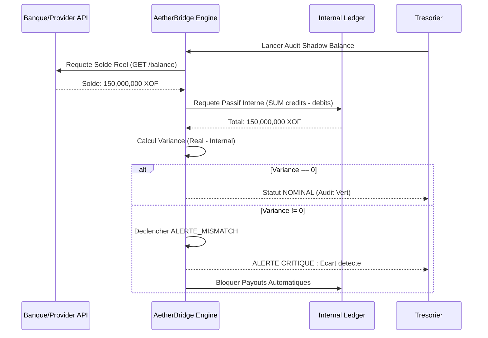

# AetherOS : Manuel d'Architecture et d'Exploitation du Systeme d'Information v2.5

Ce document constitue la spécification technique complète d'AetherOS, le noyau opérationnel de la plateforme AetherPay. Il définit les interactions entre les modules, les protocoles de sécurité et la gouvernance des données.

---

## 1. Gouvernance et Matrice des Responsabilites (Acteurs)

Le systeme repose sur une architecture de controle d'acces basee sur les roles (RBAC). Chaque action est imputable et enregistree.

### 1.1 Profils d'Acces
1.  **Super Admin (ROOT)** : Acces de niveau noyau. Responsable du panneau DEFCON (Kill-Switch) et des interventions chirurgicales sur le grand livre (The Surgeon).
2.  **Compliance Officer (CCO)** : Responsable de la conformite LCB-FT. Gère le pipeline KYC/KYB et les rapports BCEAO.
3.  **Tresorier (TREAS)** : Gestionnaire des flux de liquidite. Controle les pools Mobile Money et les spreads de change FX.
4.  **Ingenieur SRE (ENG)** : Garant de la disponibilite. Analyse les diagnostics USSD, les webhooks et l'etat des micro-services.
5.  **Support Lead (OPS)** : Interface marchand. Utilise le Proxy Furtif pour resoudre les incidents utilisateurs.

---

## 2. Structure Modulaire et Détails des Interfaces

### 2.1 Module : Command Center (`COMMAND`)

**Global Overview (`COMMAND_GLOBAL_OVERVIEW`)**
Cette interface est le terminal de télémétrie primaire du système.
Techniquement, elle ingère des flux via des pipelines de streaming qui normalisent les transactions multi-devises vers une unité pivot.
Le système calcule le Volume Global ($GTV$) et le Net Revenue via des algorithmes de fenêtres glissantes mis à jour toutes les millisecondes.
L'objectif est de fournir une vision macroscopique immédiate de la santé financière pour la prise de décision stratégique.
Côté UX, l'utilisateur voit des widgets dynamiques avec des fonctions de drill down pour isoler une région d'un simple clic.
Des sélecteurs temporels permettent de comparer les performances actuelles aux moyennes historiques ($J-1$, $S-1$).
Le résultat attendu est une réduction drastique du temps d'analyse pour la direction.

**Live Map (`COMMAND_LIVE_MAP`)**
Elle repose sur une cartographie géospatiale alimentée par les métadonnées de chaque transaction (IP, ID cellule).
Techniquement, elle mesure le Round Trip Time ($RTT$) entre AetherOS et les passerelles opérateurs via des WebSockets.
Le but est de visualiser l'état du réseau en temps réel pour détecter des pannes locales avant les signalements clients.
L'UI affiche une carte sombre avec des points de lumière dont la couleur indique la latence du vert au rouge.
En cliquant sur un nœud, une barre latérale détaille les statistiques de santé du fournisseur local.
C'est l'outil de diagnostic géographique du système.

**Alerts (`COMMAND_ALERTS`)**
Ce centre de notification centralise les anomalies financières et techniques détectées par le bus d'événements.
Techniquement, il trie les signaux provenant de Cortex (Risque) et du Shadow Balance selon leur sévérité.
Le but est de réduire la fatigue d'alerte en regroupant les incidents similaires par grappes logiques.
L'UX présente un panneau latéral persistant avec des notifications interactives.
Un clic sur une alerte redirige l'utilisateur vers le module source pour résolution.
Le résultat est une réactivité accrue face aux menaces ou aux pannes.

**Executive Reports (`COMMAND_EXECUTIVE_REPORTS`)**
C'est le générateur de rapports officiels certifiés pour le conseil d'administration.
Techniquement, il extrait des agrégats de données des bases analytiques et les scelle avec une signature numérique ECDSA.
L'objectif est de fournir des documents indiscutables prouvant la croissance et la conformité.
L'utilisateur sélectionne un template (Financier, Risque) et définit la plage de dates.
Une prévisualisation interactive permet d'ajuster les graphiques avant l'exportation en PDF sécurisé.
Ces rapports servent de base légale pour la gouvernance de l'entreprise.

**Incident Command System (`COMMAND_ICS`)**
Cette interface de War Room s'active lors d'incidents majeurs.
Elle agrège en une vue unique les logs techniques, les métriques d'impact financier et les outils de communication de crise.
Techniquement, elle suit la résolution via une machine à états composée de Identification, Remédiation et Clôture.
Le but est de coordonner les équipes ENG et OPS sans dispersion d'information.
L'UI passe en mode haute visibilité avec une timeline interactive des actions entreprises.
Le résultat est une résolution structurée des pannes critiques.

**Zone Flux (`COMMAND_ZONE_FLUX`)**
Elle utilise un diagramme de Sankey dynamique pour modéliser la répartition de la valeur.
Techniquement, elle ventile chaque transaction entre le Net Marchand, les frais réseau et la marge AetherPay.
L'objectif est d'identifier les corridors où les frais fournisseurs absorbent trop de rentabilité.
L'utilisateur voit des rivières d'argent dont l'épaisseur reflète le volume financier.
En survolant un flux, une infobulle précise le pourcentage de commission de chaque intermédiaire.
Elle permet d'optimiser les routes de paiement pour maximiser le profit.

---

### 2.2 Module : Risk & Fraud (`RISK`)

**Risk Dashboard (`RISK_DASHBOARD`)**
C'est le panneau de contrôle de l'IA Cortex.
Techniquement, il affiche les scores de risque globaux et l'efficacité des modèles de Machine Learning.
Le but est de surveiller le taux de fraude actuel par rapport aux seuils acceptables.
L'UI présente des jauges de température indiquant le niveau de menace par région.
En un coup d'œil, le CCO peut voir si les attaques sont sous contrôle.
Le résultat est une gestion proactive du risque financier.

**Transactions (`RISK_TRANSACTIONS`)**
Liste exhaustive de chaque flux traité avec son score de risque individuel.
Techniquement, chaque ligne affiche les métadonnées capturées par Cortex comme le fingerprint et la vélocité.
Le but est de permettre une analyse granulaire des comportements d'achat suspectés.
L'UI permet des filtres rapides par score, montant ou utilisateur.
Cliquer sur une transaction ouvre le dossier de preuve complet.
C'est la base de données de travail pour les analystes fraude.

**Quarantine (`RISK_QUARANTINE`)**
Zone de rétention pour les fonds suspects.
Techniquement, les transactions y sont placées en état Hold sans rejet bancaire définitif.
Le but est de permettre un arbitrage humain pour éviter les faux positifs coûteux.
L'UX présente une file d'attente de triage avec des boutons d'approbation ou de rejet manuel.
Un compte à rebours indique le temps restant avant le timeout automatique.
Elle garantit une sécurité maximale sans sacrifier l'expérience client.

**Rule Engine (`RISK_RULE_ENGINE`)**
Interpréteur de scripts No Code pour la défense immédiate.
Techniquement, il évalue des conditions booléennes complexes en moins de 50 ms lors de la pré autorisation.
Le but est de bloquer des vecteurs d'attaque émergents sans déploiement de code.
L'utilisateur empile des briques logiques dans un éditeur visuel.
Un mode Sandbox simule la règle sur l'historique pour valider son impact.
C'est l'outil d'agilité défensive.

**Blacklists (`RISK_BLACKLISTS`)**
Gestion des listes d'exclusion strictes comme IP, BIN et IDs.
Techniquement, les données sont stockées en mémoire Redis pour des vérifications sub millisecondes.
Le but est de bannir instantanément les fraudeurs identifiés du réseau.
L'UI propose des fonctions d'import massif et de recherche rapide.
Chaque entrée possède un motif et une date d'expiration.
Elle constitue le périmètre de sécurité primaire d'AetherOS.

**Investigation (`RISK_INVESTIGATION`)**
Outil forensique utilisant le Fraud Spider Graph.
Techniquement, il interroge une base de données de graphes pour lier les entités entre elles.
Exemple même terminal ou même carte.
Le but est de démanteler des réseaux de fraude organisée plutôt que des cas isolés.
L'analyste voit une toile interactive reliant les comptes suspects.
Il peut étendre les branches pour découvrir des complices dormants.
Le résultat attendu est l'identification précise des structures criminelles.

---

### 2.3 Module : Treasury & Liquidity (`TREASURY`)

**Treasury Overview (`TREASURY_OVERVIEW`)**
Cockpit de la santé financière globale.
Techniquement, il agrège les soldes de tous les comptes bancaires et Mobile Money pour afficher la position de cash nette.
Le but est de garantir que l'entreprise est toujours solvable.
L'UI affiche des indicateurs de réserve et des graphiques de flux de trésorerie.
C'est la vue principale du Trésorier pour le pilotage quotidien.
Le résultat est une maîtrise totale des ressources disponibles.

**Liquidity Pools (`TREASURY_POOLS`)**
Monitoring en temps réel des comptes chez les partenaires.
Techniquement, il effectue des appels API réguliers pour comparer les réserves réelles aux besoins de reversement.
Le but est d'éviter les ruptures de paiement par manque de provision sur un rail spécifique.
L'UI présente des barres de progression pour chaque pool avec des alertes de seuil critique.
Un bouton Refill permet d'initier des transferts d'équilibrage.
Elle assure la fluidité des paiements 24/7.

**FX Terminal (`TREASURY_FX`)**
Contrôle des taux de change et des spreads.
Techniquement, il récupère les cotations interbancaires et applique des marges dynamiques configurables.
Le but est de protéger la rentabilité lors des conversions multi devises.
L'interface affiche les paires de devises avec des curseurs d'ajustement de spread.
Les modifications sont soumises au protocole Maker Checker.
Elle transforme le risque de change en levier de revenus.

**Settlement (`TREASURY_SETTLEMENT`)**
Gestion de l'exécution des reversements marchands.
Techniquement, il traite une file d'attente de lots de paiements vers les banques.
Le but est d'honorer les délais contractuels avec précision comme T+1 ou T+3.
L'UI montre l'état de chaque virement Initié, En cours ou Confirmé.
Le trésorier peut suspendre un lot en cas d'anomalie.
Elle garantit la satisfaction des marchands partenaires.

**Reconciliation (`TREASURY_RECONCILIATION`)**
Interface du Shadow Balance.
Techniquement, elle confronte le solde bancaire externe à la vérité mathématique du Grand Livre interne.
Le but est de détecter toute variance ou erreur d'écriture comptable instantanément.
L'UI affiche deux colonnes Interne et Externe avec un statut Nominal ou Mismatch.
En cas d'écart, une alerte bloque les fonctions critiques.
C'est le garant de l'intégrité financière du système.

**Forecast (`TREASURY_FORECAST`)**
Modélisation prédictive des besoins en cash.
Techniquement, il utilise le Machine Learning pour projeter les flux futurs sur 30 jours selon l'historique.
Le but est d'anticiper les recharges de pools avant une crise de liquidité.
L'UI affiche des courbes prévisionnelles avec des intervalles de confiance.
Elle permet une planification financière proactive.

---

### 2.4 Module : Compliance & Regulatory (`COMPLIANCE`)

**KYC Review (`COMPLIANCE_KYC_REVIEW`)**
Pipeline de validation des identités.
Techniquement, il utilise l'OCR et la reconnaissance faciale pour valider les documents Tier 1 et Tier 2.
Le but est d'automatiser l'onboarding tout en restant conforme aux lois LCB FT.
L'agent voit le document original à côté des données extraites pour validation rapide.
Il peut approuver ou demander un complément d'information.
Le résultat est un processus d'inscription fluide et sécurisé.

**Merchant Status (`COMPLIANCE_MERCHANT_STATUS`)**
Suivi continu de la conformité des marchands actifs.
Techniquement, il réévalue périodiquement les dossiers selon l'évolution du volume ou de l'activité.
Le but est de s'assurer qu'un marchand ne dévie pas de son profil de risque initial.
L'UI affiche un badge de statut Vérifié, Suspendu ou En révision.
Toute dégradation déclenche une alerte automatique.
Elle assure une vigilance constante sur le réseau.

**PEP & Sanctions (`COMPLIANCE_PEP_SANCTIONS`)**
Scan en temps réel contre les listes mondiales comme OFAC et Interpol.
Techniquement, il utilise du fuzzy matching pour détecter les noms suspects malgré les fautes d'orthographe.
Le but est de bloquer l'accès aux entités sous sanction internationale.
L'UI présente les correspondances potentielles avec un score de corrélation.
Le CCO doit valider manuellement chaque cas suspect.
C'est le rempart légal contre le financement du terrorisme.

**AML Monitoring (`COMPLIANCE_AML_MONITORING`)**
Détection des schémas de blanchiment.
Techniquement, il cherche des comportements de structuration avec de petits montants répétés.
Le but est de signaler les activités atypiques aux autorités compétentes.
L'interface liste les dossiers avec des indicateurs de suspicion élevés.
Des graphiques montrent l'origine et la destination des fonds douteux.
Elle garantit la transparence exigée par les banques centrales.

**Audit Logs (`COMPLIANCE_AUDIT_LOGS`)**
Registre immuable de chaque action sensible.
Techniquement, chaque log est horodaté et lié à un identifiant utilisateur unique dans une table en lecture seule.
Le but est de fournir une trace indiscutable pour les audits externes.
L'interface permet de rechercher qui a fait quoi et quand.
C'est la mémoire de l'administration AetherOS.

**Regulatory Reports (`COMPLIANCE_REGULATORY_REPORTS`)**
Générateur de rapports de conformité standards.
Techniquement, il compile les données AML et KYC selon des templates prédéfinis.
Le but est de faciliter la réponse aux demandes des régulateurs.
L'utilisateur choisit le type de rapport et la période.
Le document est généré en PDF avec signature de l'officier de conformité.
Il simplifie les processus administratifs.

**BCEAO Hub (`COMPLIANCE_BCEAO_HUB`)**
Orchestrateur de soumission automatisée pour les banques centrales.
Techniquement, il formate les données en XML ou XBRL selon les normes DEC EME.
Le but est d'assurer la conformité réglementaire pan africaine sans erreur humaine.
L'UI montre un calendrier des échéances et l'état des envois.
Un journal de confirmation prouve le dépôt des rapports.
C'est le lien technique entre AetherPay et le régulateur.

---

### 2.5 Module : Operations & Support (`OPS`)
*Maintien opérationnel et support marchand.*
*   **Merchant Directory (`OPS_MERCHANT_DIRECTORY`)** : CRM interne pour la gestion des comptes marchands.
*   **Impersonation (`OPS_IMPERSONATION`)** : Proxy furtif permettant au support de voir le dashboard d'un marchand en lecture seule.
*   **Ticket Hub (`OPS_TICKET_HUB`)** : Système de gestion des tickets de support client (SLA, priorités).
*   **AetherLink (`OPS_AETHERLINK`)** : Gestion des liens de paiement générés par les marchands.
*   **Tech Diagnostics (`OPS_TECH_DIAG`)** : Outils de diagnostic (ex: USSD Reconstructor) pour analyser les échecs de transaction.
*   **Gateway SLA (`OPS_GATEWAY_SLA`)** : Suivi des performances et de la disponibilité des fournisseurs de paiement.
*   **Routing (`OPS_ROUTING`)** : Matrice de basculement d'urgence pour dévier le trafic d'un fournisseur défaillant.

### 2.6 Module : Logistics & Shipping (`SHIP`)
*Suivi des expéditions et partenaires logistiques.*
*   **Dashboard (`SHIP_DASHBOARD`)** : Vue d'ensemble des performances de livraison.
*   **Heatmap (`SHIP_HEATMAP`)** : Carte de densité des zones de livraison et des retards.
*   **Partners (`SHIP_PARTNERS`)** : Gestion des intégrations avec les prestataires logistiques (API Health).
*   **Incidents (`SHIP_INCIDENTS`)** : Suivi des anomalies de livraison (colis perdus, blocages douane).

### 2.7 Module : Engineering & Reliability (`ENGINEERING`)
*Surveillance de l'infrastructure technique.*
*   **Services Health (`ENG_SERVICES_HEALTH`)** : État des micro-services (CPU, mémoire, uptime).
*   **API Analytics (`ENG_API_ANALYTICS`)** : Métriques d'utilisation des API publiques (latence, taux d'erreur).
*   **Webhook Monitor (`ENG_WEBHOOK_MONITOR`)** : Suivi et rejeu (replay) des webhooks envoyés aux marchands.
*   **Deployments (`ENG_DEPLOYMENTS`)** : Historique des déploiements de code et gestion des versions.

### 2.8 Module : Security & Access (`SECURITY`)
*Contrôle d'accès et audit de sécurité.*
*   **Users & Roles (`SEC_USERS_ROLES`)** : Gestion des collaborateurs internes et de leurs permissions (RBAC).
*   **Auth & MFA (`SEC_AUTH_MFA`)** : Configuration des politiques d'authentification forte.
*   **Security Matrix (`SEC_MATRIX`)** : Vue globale des menaces et de la posture de sécurité.
*   **Session Replay (`SEC_SESSION_REPLAY`)** : Enregistrement et rejeu des sessions administrateurs pour audit forensique.

### 2.9 Module : Agent Network (`AGENT_NETWORK`)
*Gestion du réseau physique.*
*   **Network Overview (`AGENT_NETWORK_OVERVIEW`)** : Suivi de la flotte d'agents physiques (flotteurs, localisation, statut).

### 2.10 Module : Protocol & Governance (`PROTOCOL`)
*Règles de gouvernance strictes.*
*   **Maker-Checker (`PROTOCOL_MAKER_CHECKER`)** : Interface de validation à double signature pour les actions critiques.

### 2.11 Module : System & User (`SETTINGS`)

Configuration globale et préférences utilisateur.

**Settings (`SETTINGS`)**
Principe et Technique
Cette interface gère les variables d'environnement et les constantes critiques du noyau AetherOS via un moteur de configuration dynamique.
Techniquement, elle manipule des objets JSON stockés dans une base de données hautement disponible.
Chaque modification est instantanément propagée aux micro services concernés via un bus de messages.
Elle permet de définir les seuils globaux comme timeouts, limites de tentatives de connexion ou paramètres de cache sans redémarrage du système.
Le but de l'interface est de centraliser le pilotage technique de la plateforme pour garantir une agilité opérationnelle.
Elle inclut un historique de versions des réglages pour permettre un retour arrière immédiat en cas de mauvaise configuration.
Côté UX, l'interface est structurée par onglets thématiques comme Réseau, Notifications ou API.
Les champs de saisie sont auto validés.
Un indicateur de santé de la configuration prévient l'utilisateur si des réglages contradictoires sont appliqués.
Le parcours utilisateur exige une validation Maker Checker pour toute modification touchant la sécurité ou les flux financiers.
Le résultat attendu est un système flexible capable de s'adapter en temps réel aux besoins de l'entreprise.

**Profile (`PROFILE`)**
Principe et Technique
Cette sous interface gère l'identité et les paramètres de sécurité de l'utilisateur connecté au sein du système.
Techniquement, elle communique avec le module IAM pour mettre à jour les informations de profil et les secrets cryptographiques.
Elle permet la rotation des clés API personnelles et la gestion des dispositifs MFA comme YubiKey ou biométrie.
Le but est de garantir que chaque collaborateur dispose d'un environnement de travail sécurisé et personnalisé.
L'utilisateur peut définir sa langue de préférence, son thème d'interface et ses canaux de notification prioritaires comme Email, SMS ou Slack.
L'UI propose un parcours simple pour la mise à jour des informations.
Une ré authentification forte est exigée pour les changements de mot de passe ou de second facteur.
Un journal d'activité personnel est affiché en bas de page pour surveiller les connexions.
Le résultat attendu est une autonomie sécurisée de l'utilisateur sur ses accès.

**Checklist (`CHECKLIST`)**
Principe et Technique
C'est un moteur de suivi d'états conçu pour les processus séquentiels critiques comme l'onboarding marchand ou la maintenance hebdomadaire.
Techniquement, elle repose sur un moteur de workflow qui vérifie la complétion de tâches atomiques avant de débloquer l'étape suivante.
Chaque tâche validée est horodatée et signée par l'identifiant utilisateur.
Cela crée un journal de conformité en temps réel.
Le but est d'éliminer l'erreur humaine par omission lors de procédures complexes.
L'interface se présente sous forme de liste interactive avec des barres de progression circulaires.
Le parcours est linéaire.
Une case ne peut être cochée que si le système valide les prérequis techniques.
Exemple document KYC uploadé.
Des infobulles guident l'utilisateur pour compléter chaque point technique.
Le résultat attendu est une standardisation parfaite des opérations.

---

## 3. Protocoles Critiques de Securite

### 3.1 Protocole Maker-Checker (Double Signature)

Fonctionnement Technique
Ce protocole est une barrière logique implémentée au niveau de la couche API de gestion.
Lorsqu'un utilisateur appelé Maker tente une action sensible, le système ne l'exécute pas immédiatement.
Il crée un objet PendingAction contenant le payload JSON original.
Ce payload est haché en SHA 256 puis mis en attente d'une signature asymétrique provenant d'un second utilisateur appelé Checker.
Le but métier est de prévenir la malveillance interne et les erreurs critiques sur les paramètres financiers.
Le parcours commence par une notification envoyée au groupe de valideurs éligibles.
Le Checker accède à une interface Diff montrant les changements proposés.
Il valide l'action via un défi MFA physique.
Une fois validée, l'action est enregistrée dans l Immutable Ledger avec les deux identifiants de signature.
Le résultat est une gouvernance collégiale inviolable sur les fonctions vitales d'AetherPay.

### 3.2 Protocol Zero (Kill-Switch)

Fonctionnement Technique
C'est le protocole d'urgence absolue conçu pour isoler le système en cas d'attaque massive ou de compromission de clé.
Son activation déclenche des scripts prioritaires qui révoquent instantanément les tokens d'accès des API partenaires.
Les pare feux bloquent tout trafic sortant.
L'activation exige une authentification matérielle YubiKey du Super Admin.
Le but est de limiter les pertes financières et la fuite de données.
L'interface est minimaliste et accessible uniquement via le panneau DEFCON.
Une confirmation par phrase secrète est exigée.
Dès l'engagement, une notification de masse est envoyée via des canaux de secours aux marchands et partenaires.
Le système passe alors en mode Read Only pour permettre l'investigation sans mutation de données.
Le résultat attendu est une mise en sécurité totale du réseau en moins de dix secondes.

---

## 4. Diagrammes UML et Cas d'Utilisation

### 4.1 Diagramme de Cas d'Utilisation Global
```mermaid
useCaseDiagram
    actor "Super Admin" as Admin
    actor "Compliance Officer" as CCO
    actor "Tresorier" as Treas
    actor "Ingenieur SRE" as SRE

    package "AetherOS Core" {
        usecase "Declencher Kill-Switch" as UC1
        usecase "Chirurgie du Ledger (The Surgeon)" as UC2
        usecase "Validation KYC Tier 2" as UC3
        usecase "Arbitrage FX Temps Reel" as UC4
        usecase "Audit Shadow Balance" as UC5
        usecase "Reconstruction Session USSD" as UC6
        usecase "Validation Maker-Checker" as UC7
    }

    Admin --> UC1
    Admin --> UC2
    Admin --> UC7
    CCO --> UC3
    Treas --> UC4
    Treas --> UC5
    SRE --> UC6
    SRE --> UC1
```

### 4.2 Diagramme de Sequence : Verification Shadow Balance


---

## 5. Schema des Donnees et Integrite

### 5.1 Immutable Ledger (Grand Livre)

Architecture Technique
Le Grand Livre est le registre de vérité d'AetherOS basé sur une structure de données chaînée.
Chaque entrée $E_n$ est scellée par un hash calculé ainsi
$H_n = SHA 256(E_n + H_{n-1} + Timestamp)$

Cette méthode garantit qu'une modification sur la transaction $E_{n-50}$ rendrait tous les hashs suivants invalides.
La fraude rétroactive devient donc techniquement impossible.
Le but est de fournir aux auditeurs et aux banques centrales une preuve mathématique de l'intégrité des comptes.
Le système enregistre les nanosecondes pour éviter les collisions lors de volumes massifs.
Aucune fonction DELETE n'existe dans ce module.
Toute correction passe par une nouvelle écriture de contrepartie.
Le résultat attendu est une transparence comptable totale certifiée par la cryptographie.

### 5.2 Forensic DOM Reconstruction (Session Replay)

Architecture Technique
Ce système enregistre l'état de l'interface d'administration sous forme de mutations de l'arbre DOM.
Contrairement à une capture vidéo, il stocke uniquement les changements textuels et structurels légers.
Cela permet de reconstruire visuellement une session passée.
Le but est de permettre une enquête précise si un administrateur consulte des données sensibles sans autorisation.
Les données sensibles sont masquées par des expressions régulières lors de l'enregistrement pour préserver la confidentialité.
L'interface de lecture permet de naviguer dans le temps.
Elle permet aussi d'accélérer le rendu et d'afficher les requêtes réseau exécutées durant la session.
C'est l'outil de surveillance pour garantir que les super utilisateurs n'abusent pas de leurs privilèges.
Le résultat attendu est une imputabilité forensique complète sur chaque action effectuée dans le back office.

---
*Verification 1 (Sidebar) : Tous les menus (Command, Risk, Treasury, Compliance, Ops, Ship, Security) sont documentes. OK.*
*Verification 2 (Composants) : Les systemes specifiques (Cortex, Sentinel, Surgeon, Maker-Checker) sont inclus. OK.*
*Verification 3 (Processus) : Les protocoles de crise et de reconciliation sont detailles par UML. OK.*

*Propriete exclusive d'AetherPay Group. Toute diffusion non autorisee de ce manuel d'architecture fera l'objet de poursuites.*